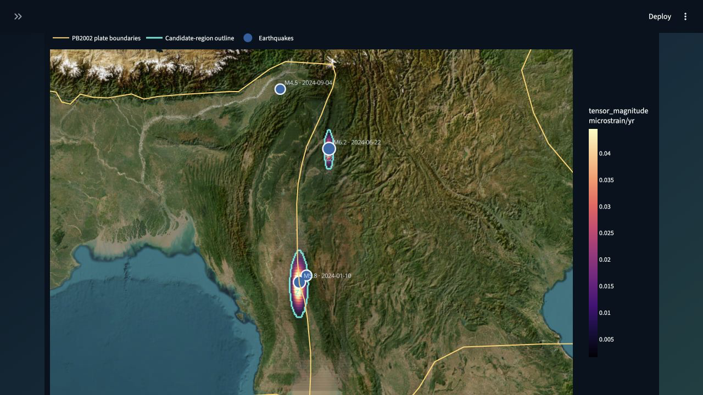

# Automated Strain Rate

[](https://github.com/ZuhairQuakes/automated-strain-rate/actions/workflows/repository-quality.yml)
[](https://zuhairquakes.github.io/automated-strain-rate/)
[](LICENSE)
[](https://www.python.org/downloads/)

An open-source Python toolkit for turning horizontal GNSS velocities into
reproducible two-dimensional crustal strain-rate fields. The tested numerical
core derives strain tensors from regular velocity grids; an optional GMT
`gpsgridder` pipeline automates interpolation from station observations.

[](https://zuhairquakes.github.io/automated-strain-rate/)

**[Explore the browser-only interactive map →](https://zuhairquakes.github.io/automated-strain-rate/)**

## Capabilities

- Validate whitespace-delimited GNSS velocity catalogues.
- Interpolate east and north velocities with GMT `gpsgridder` using a safe,
  recorded argument vector.
- Derive normal strain, tensor shear, rotation, dilatation, principal strain
  rates, maximum shear, and tensor magnitude.
- Write analysis-ready NetCDF with coordinates, units, method, and interpolation
  parameters in the metadata.
- Test the numerical implementation against an affine velocity field with a
  known analytical strain tensor.
- Inspect data or derive strain from existing GMT grids without rerunning the
  interpolation.

Read [`SCIENTIFIC_METHOD.md`](SCIENTIFIC_METHOD.md) before interpreting results.
This is research software, not an operational hazard assessment.

## Experimental: strain anomaly + earthquake explorer

An isolated research module now detects coherent high-`tensor_magnitude`
regions directly from the numerical NetCDF field, overlays a validated local or
cached USGS earthquake catalogue, and produces **candidate regions for expert
investigation**. It does not modify the validated strain-rate calculation.

```bash
python -m pip install -e ".[investigation]"
strain-rate investigate outputs/grid-03/strain-rate.nc outputs/investigation \
  --variable tensor_magnitude \
  --percentile 95 \
  --earthquakes earthquakes.csv \
  --buffer-km 50 \
  --sensitivity-percentiles 90 95 97.5 99
```

The command writes a candidate-zone CSV, raster-footprint GeoJSON, map,
diagnostic plot, processing metadata, and sensitivity summary. Read the complete
method, assumptions, USGS option, output schema, validation, and limitations in
[`EXPERIMENTAL_ANOMALY_EXPLORER.md`](EXPERIMENTAL_ANOMALY_EXPLORER.md).

A deterministic demonstration is included:

```bash
python examples/create_synthetic_investigation.py
strain-rate investigate outputs/synthetic-input/strain-rate.nc \
  outputs/synthetic-investigation \
  --earthquakes outputs/synthetic-input/earthquakes.csv
```

### Interactive web app

The project offers two complementary interfaces:

- The [static results explorer](https://zuhairquakes.github.io/automated-strain-rate/)
  opens immediately in a browser and presents the reproducible example result
  set without a Python server. It supports pan/zoom, layer visibility,
  candidate-region popups, earthquake magnitude filtering, and magnitude/date
  labels.
- The Streamlit application performs interactive analysis of uploaded data and
  exposes the scientific parameters described below.

The lightweight Streamlit explorer is a presentation layer over the same tested
numerical modules. It starts with the deterministic demonstration and lets a
researcher upload NetCDF and earthquake CSV files, change the threshold,
smoothing, connectivity, minimum size, morphology and association buffer, then
inspect an Esri World Imagery basemap without administrative boundaries, a
transparent georeferenced strain overlay, Bird's PB2002 tectonic boundaries,
candidate-zone table and 90/95/97.5/99% sensitivity response.

```bash
python -m pip install -e ".[app]"
strain-rate-app
```

For Streamlit Community Cloud, use `streamlit_app.py` as the entry point;
[`requirements.txt`](requirements.txt) installs the app dependencies. A
container deployment is also supported:

```bash
docker build -t strain-anomaly-explorer .
docker run --rm -p 8501:8501 strain-anomaly-explorer
```

The web interface performs segmentation on the uploaded numerical field, never
on a rendered image. It does not add a hazard or earthquake-risk score.
The basemap and tectonic overlay require an internet connection. The tectonic
layer uses the [PB2002 plate-boundary model](https://doi.org/10.1029/2001GC000252)
published by Bird (2003), delivered through the
[Hugo Ahlenius/Nordpil GeoJSON conversion](https://github.com/fraxen/tectonicplates)
under the Open Data Commons Attribution License. Esri World Imagery attribution
is displayed on the map.

**Spatial coincidence between high strain rate and earthquakes does not
demonstrate causality and this tool does not provide earthquake forecasts or
operational hazard assessments.**

## Install

```bash
git clone https://github.com/ZuhairQuakes/automated-strain-rate.git
cd automated-strain-rate
python -m venv .venv
source .venv/bin/activate
python -m pip install .
```

To install the complete command-line and web software directly from GitHub:

```bash
python -m pip install "automated-strain-rate[app] @ git+https://github.com/ZuhairQuakes/automated-strain-rate.git"
strain-rate-app
```

Python 3.10 or newer is required. GMT is only required for the end-to-end
interpolation command. Install the complete Conda environment with:

```bash
conda env create -f environment.yml
conda activate automated-strain-rate
```

## Command line

Validate and summarize the bundled station field:

```bash
strain-rate inspect data/mymr_vel_space_ITRF2014.txt
```

Run GMT interpolation and derive a NetCDF strain-rate field:

```bash
strain-rate compute data/mymr_vel_space_ITRF2014.txt outputs/grid-03 \
  --region 94.5 98 16 28 \
  --spacing 0.3 \
  --poisson 0.5 \
  --fudge-factor 0.01 \
  --eigenvalue-cutoff 0.0001
```

Derive strain from existing GMT grids without invoking GMT:

```bash
strain-rate derive velocity_u.nc velocity_v.nc strain-rate.nc
```

Use `strain-rate --help` for all options.

## Python API

```python
import numpy as np
from automated_strain_rate import strain_from_regular_grid

longitude = np.linspace(95, 98, 31)
latitude = np.linspace(16, 28, 121)
east_velocity = np.zeros((latitude.size, longitude.size))  # mm/yr
north_velocity = np.zeros_like(east_velocity)

strain = strain_from_regular_grid(
    east_velocity,
    north_velocity,
    longitude,
    latitude,
    velocity_unit="mm/yr",
)
strain.to_netcdf("strain-rate.nc")
```

## Input format

The station reader expects:

```text
Lon Lat Ve Vn Vu Se Sn Su Name
```

Longitude and latitude are decimal degrees. Velocity units are selected by the
caller and must be consistent. Record reference frame, epoch, processing
source, uncertainty convention, station selection, and data licence for every
study. See [`data/Readme.md`](data/Readme.md).

## Repository map

| Path | Purpose |
| --- | --- |
| [`src/automated_strain_rate/`](src/automated_strain_rate/) | tested core plus isolated experimental anomaly and association modules |
| [`tests/`](tests/) | analytical, I/O, GMT-command, and CLI tests |
| [`nbtk/strain_rates_compute.ipynb`](nbtk/strain_rates_compute.ipynb) | historical exploratory workflow |
| [`SCIENTIFIC_METHOD.md`](SCIENTIFIC_METHOD.md) | equations, conventions, assumptions, and limitations |
| [`EXPERIMENTAL_ANOMALY_EXPLORER.md`](EXPERIMENTAL_ANOMALY_EXPLORER.md) | anomaly method, earthquake association, validation, and limitations |
| [`data/`](data/) | example station velocity field and provenance guidance |
| [`environment.yml`](environment.yml) | full Python, notebook, NetCDF, mapping, and GMT environment |
| [`streamlit_app.py`](streamlit_app.py) | interactive candidate-region and sensitivity explorer |
| [`docs/`](docs/) | browser-only results explorer published with GitHub Pages |
| [`tools/build_static_demo.py`](tools/build_static_demo.py) | reproducibly exports the static example from the tested numerical modules |

## Contribute

```bash
python -m pip install -e ".[dev,notebook]"
ruff check .
pytest
python tools/validate_repository.py
PYTHONPATH=src python tools/build_static_demo.py
python -m build
```

Scientific contributions are welcome. Read [`CONTRIBUTING.md`](CONTRIBUTING.md),
follow the [Code of Conduct](CODE_OF_CONDUCT.md), and report security issues via
[`SECURITY.md`](SECURITY.md). Software is licensed under the [MIT License](LICENSE);
research users can cite the project with [`CITATION.cff`](CITATION.cff).
